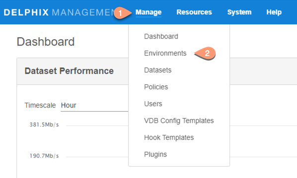
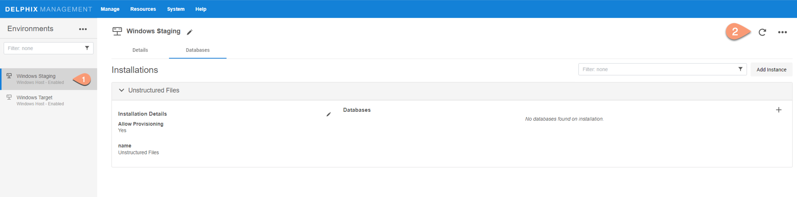

# Discovery

Environment discovery is a process that enables the Oracle on Windows Plugin to search Oracle Binaries on a host. Whenever there is any changes (installing a new binary home) to an already set up environment in the Delphix application, environment refresh needs to be performed.

Prerequisites
-------------

- Install delphix engine 6.x and above  
- Install Oracle Binaries on staging and target servers  
- Installation of the Oracle on Windows Plugin is required before the discovery  

Refresh Environment
----------------------
Environment refresh will update the metadata associated with that environment and copies new plugin to the host.

Steps:

1. Login to the Delphix Management application.   
2. Once plugin is uploaded, click Manage --> Environments

    

3. In the Environments panel, choose the environment you want to refresh and click on refresh icon.

    

4. Once environment refresh completes, installed Oracle Binaries will appear under Installations.

    

Sourceconfig
------------
Every environment contains `repositories` and each environment may have any number of repositories associated with it. `Repository` represents the binaries for oracle instance. Each repository can have many `SourceConfig` which represent oracle instance. There is no sourceconfig generated automatically in this plugin. We need to configure `SourceConfig` objects through which we can create a dSource.
