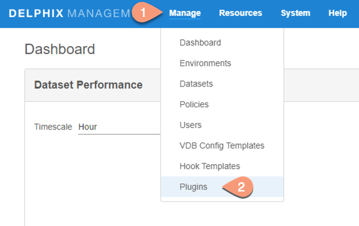
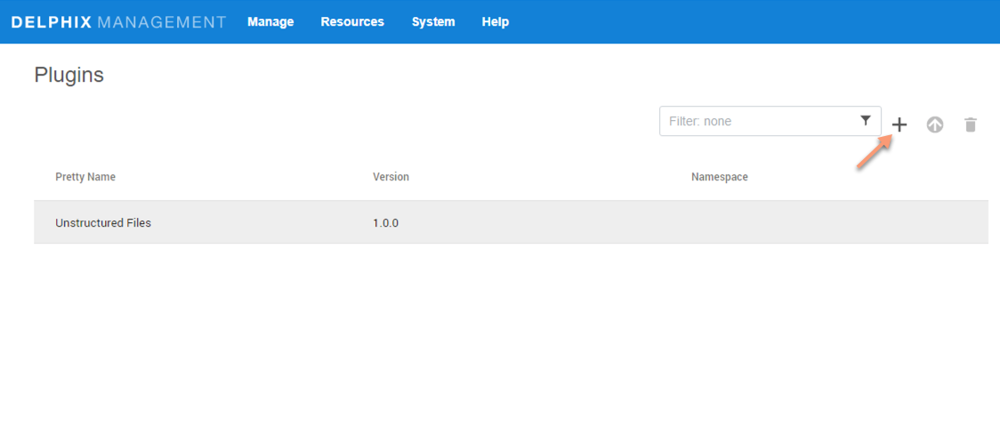
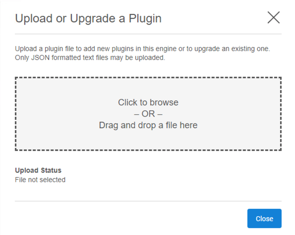
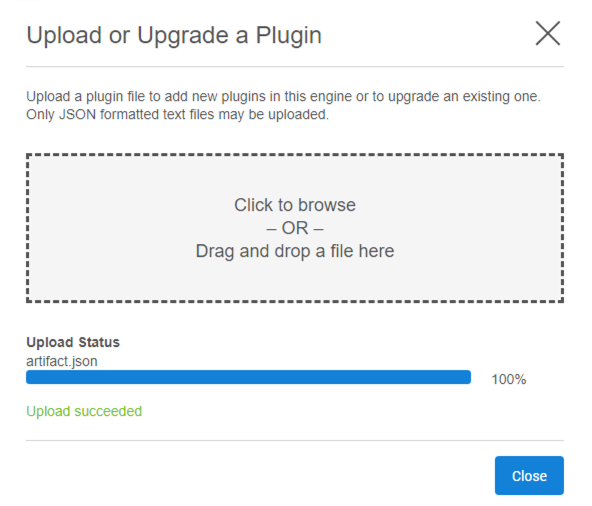
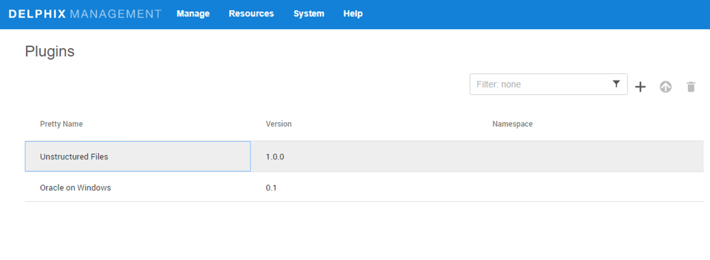

# Installation

Delphix plugin for Oracle on Windows can be installed via GUI.

Prerequisites
-------------

- Install Delphix Engine 6.x and above.
- Install Oracle Binaries on Staging and Target servers.  

Upload Oracle on Windows Plugin
----------------------

1. Click on Manage --> Plugins

    

2. Click on `+` icon

    

3. In pop-up window, browse or drag/drop the plugin file

    

4. Click on close button once upload succeeds

    

5. See the plugin version in `Plugins` section

    
