# Linking

Linking a data source will create a dSource object on the engine and allow Delphix to ingest data from this source. The dSource is an object that the Delphix Virtualization Engine uses to create and update virtual copies of your database.

Prerequisites
-------------

- Install delphix engine 6.x and above  
- Install oracle binaries on staging host  
- Execute Discovery on staging host  
- Oracle full or incremental level 0 backup along with control file backup, must be present on staging host or on SMB path accessible by staging host.

Create Source Config
---------------------------

1. Login to Delphix Management application.   
2. Click Manage --> Environments.   
3. In the Environments panel, choose the environment under which you want to create dSource, choose Oracle binaries for dSource and click on on `+` icon.       

    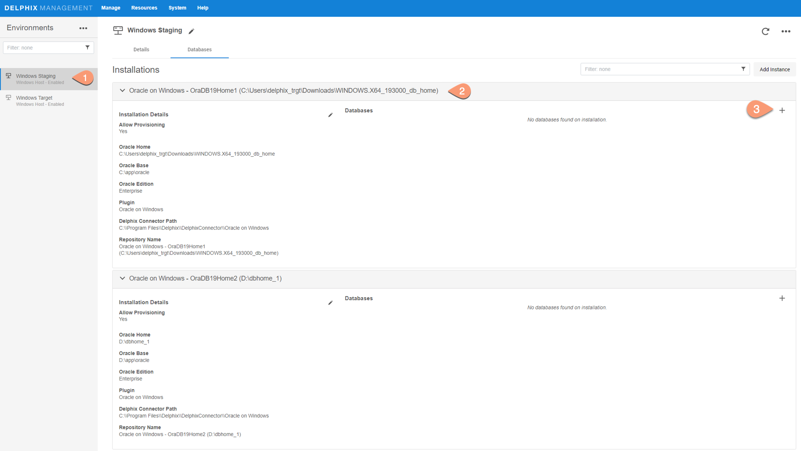    

4. In pop-up window, fill in the details for dsource

    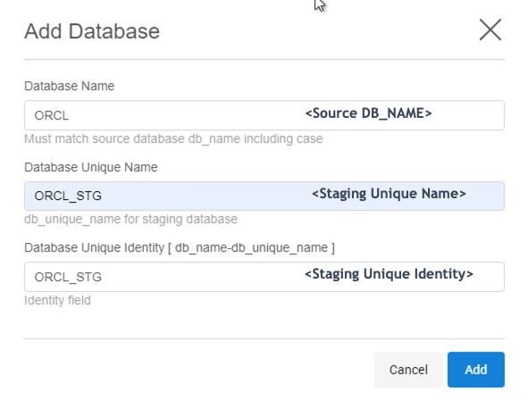   

5. Click Add.   
6. Source Config entry for dSource gets created, which will be used to create dSource.

    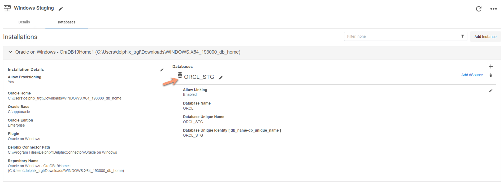   

Create dSource
--------------
Steps:

1. Once source config is created, click on `Add dSource` for config

    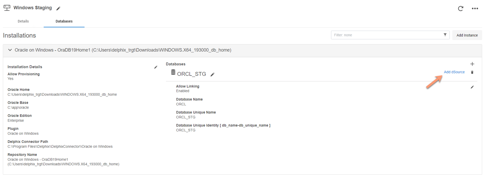   

2. In the `Add dSource` wizard, fill in the details, and click Next.

    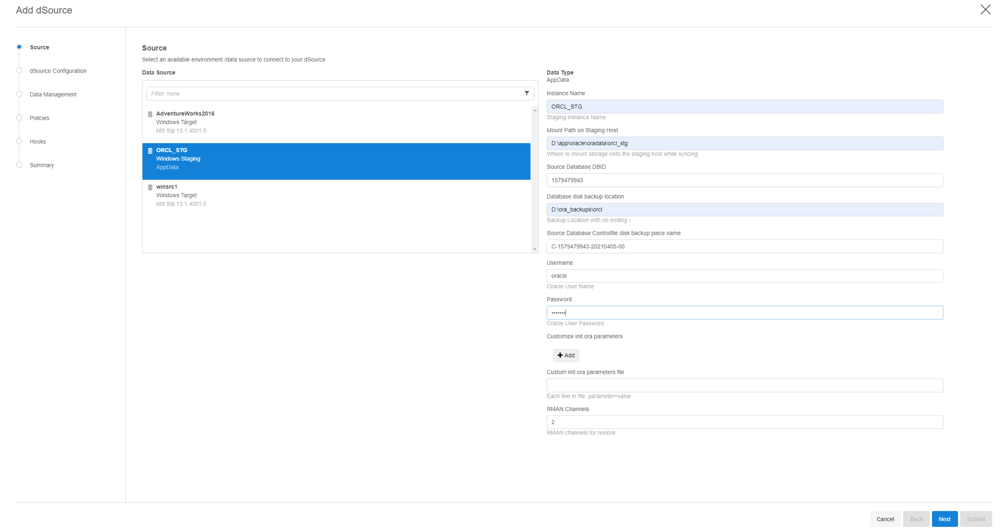   

    `Instance Name`: Staging DB instance Name   
    `Mount path on Staging Host`: iSCSI mount path for staging database   
    `Source Database DBID`: DB ID of source db from which backup was taken    
    `Database disk backup location`: Staging location or SMB path where backup files are residing   
    `Source Database Controlfile disk backup piece name`: Control File backup name under above location   
    `Username`: Oracle username on staging server   
    `Password`: Password of Oracle user mentioned above   
    `Customize init.ora parameters`: Modify init.ora parameters of Staging DB by either one of the options:   
          - Add the parameter directly by clicking `+Add` button    
          - Provide init.ora parameters file, with each parameter in new line and as format, `<parameter>=<value>`   

3. Provide dSource name and delphix group under which dSource resides. Click Next.  

    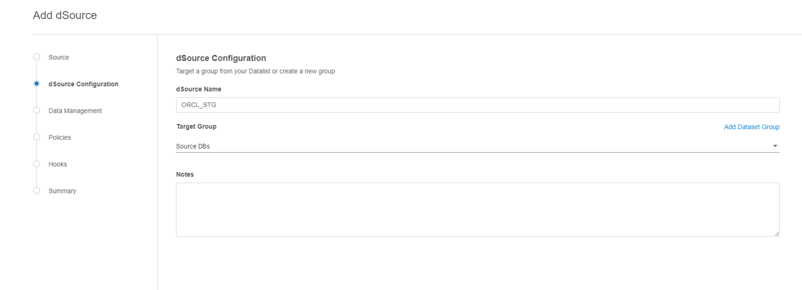   

4. Select Staging Environment and Delphix o/s user from dropdown. Click Next.   

    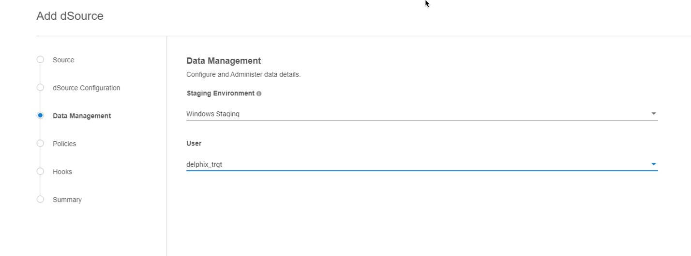  

5. Setup SnapSync or Retention Policies, if required. Click Next.   

    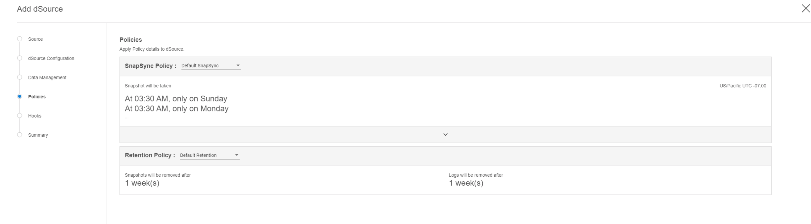

6. Setup PreSync or PostSync hooks, if required. Click Next.    

    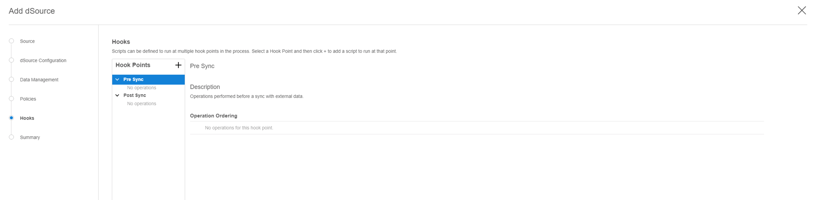

7. Review Summary of dSource linking settings and hit Submit.   

    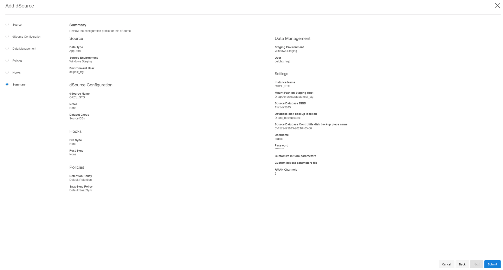

8. dSource Linking process starts. You can monitor the progress under right side `Running Actions` tab.    

    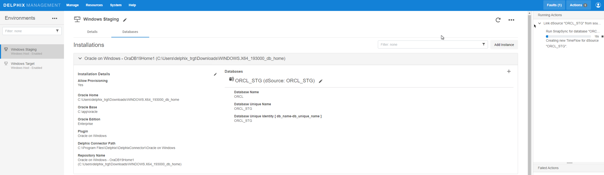

      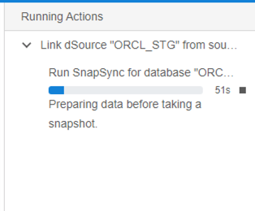

9. Once dSource is successfully created, a new snapshot will appear for dSource under Manage --> Datasets page.

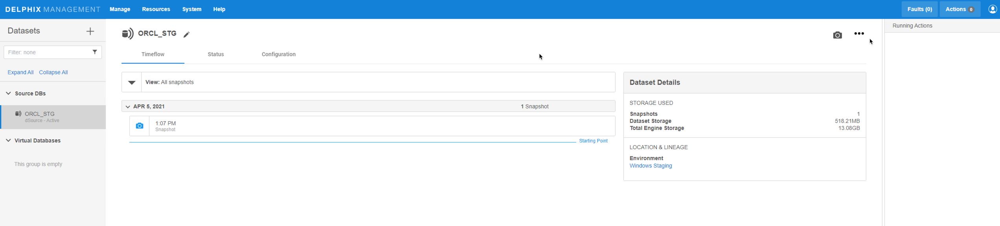
