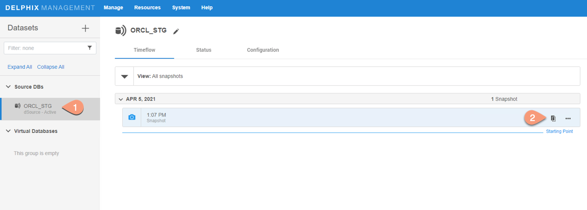
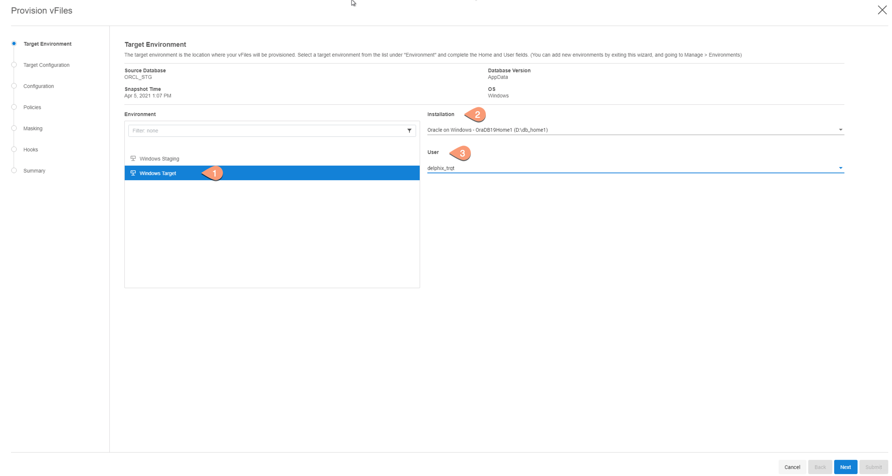
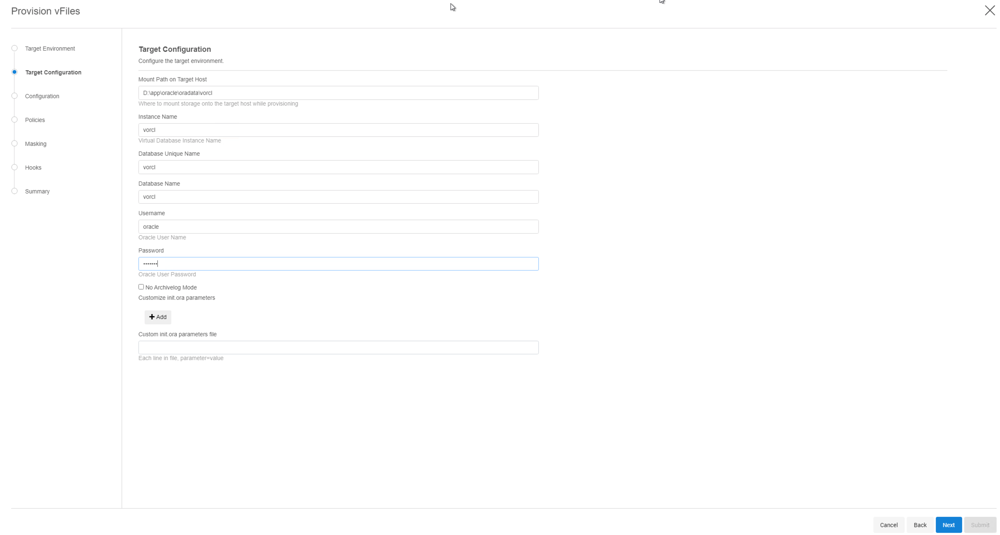
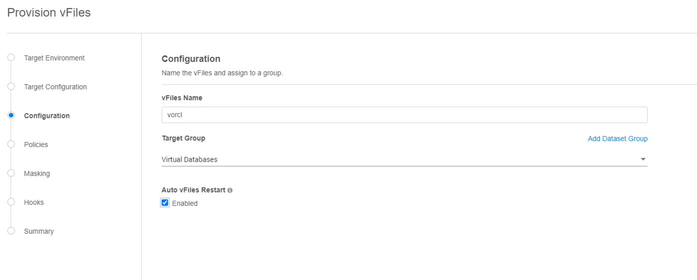
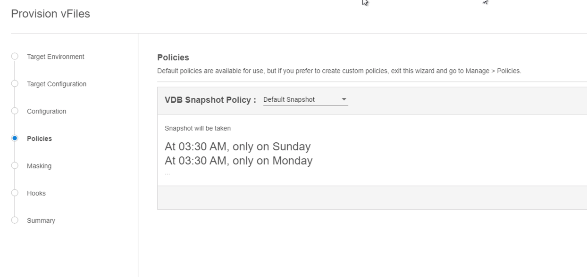
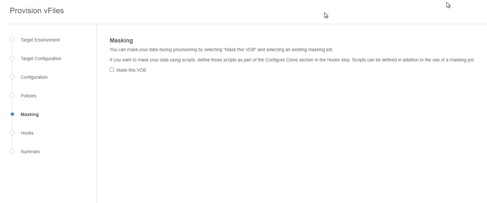
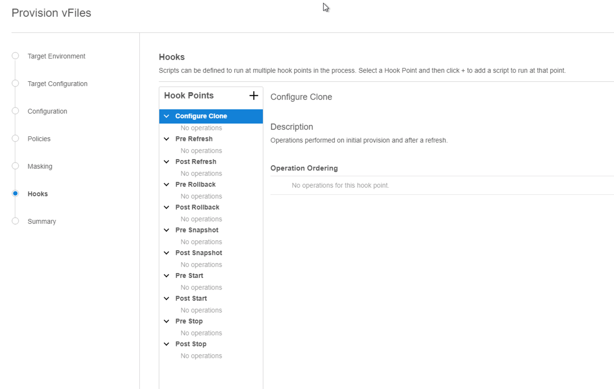
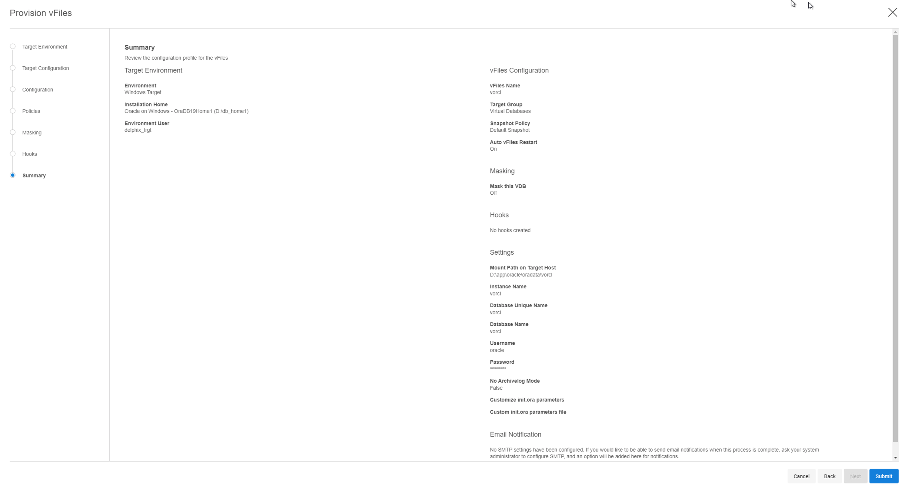
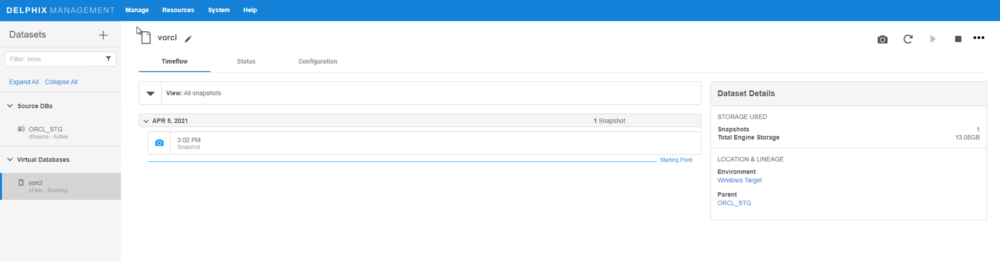

# Provisioning

This topic describes the basic concepts involved with provisioning VDBs from dSource.

A dSource is a virtualized representation of a physical or logical source database. As a virtual representation, it cannot be accessed or manipulated using database tools. Instead, you must create a virtual database (VDB) from a dSource snapshot. A VDB is an independent, writable copy of a dSource snapshot. You can also create VDBs from other VDBs. Once you have provisioned a VDB to a target environment, you can also implement snapshot and retention policies for the VDB, which will determine how frequently Delphix Engine will take a database snapshot and how long the snapshots will be retained for recovery and provisioning purposes.

Snapshots accumulate over time. To view a snapshot:

1. From the Datasets panel, click the group containing the dSource.
2. Select dSource.
3. Click the TimeFlow tab.

The TimeFlow appears as a list of dates, each of which expands to show snapshots from that date. Times, when the VDB has been refreshed, are marked by a blue line between dates.

On the TimeFlow, you can also filter by type of snapshot. To do so, click the filter button, which is shaped like an eye.

You can scroll through these lists to select the one you want, or you can enter a date and time to search for a specific snapshot.

Once you have provisioned a VDB, you can also take snapshots of it. As with the dSource snapshots, you can find these when you select the VDB in the Datasets panel. You can then provision additional VDBs from these VDB snapshots.

Dependencies

If there are dependencies on the snapshot, you will not be able to delete the snapshot free space; the dependencies rely on the data associated with the snapshot.

Provisioning VDB
----------------
This topic describes how to provision a virtual database (VDB) from an oracle dSource.

Prerequisites
-------------

- Install delphix engine 6.x and above  
- Create dSource on staging host    
- Install oracle binaries on target host   
- Add target environment to delphix  
- Execute Discovery on target host

Provision Virtual Database (VDB)
----------

1. Login to the Delphix Management application.  
2. Navigate to Manage --> Datasets.   
3. Choose a dSource snapshot from which you want to provision, and click Provision VDB icon.    

    

4. Select a Target environment from the left pane.  
5. Select an Installation to use from the dropdown list of available oracle binaries on that environment, and select environment user. Click Next.      

    

6. Enter VDB Configuration details, and click Next.

    

      `Mount Path on Target Host`: iSCSI mount path for virtual database    
        `Instance Name`: VDB Instance Name  
          `Database Unique Name`: VDB Unique Name   
            `Database Name`: VDB name   
            `Username`: Oracle username on target server     
            `Password`: Password of Oracle user mentioned above   
            `No Archivelog Mode`: By default, VDB is in archivelog mode. Check this box to disable archivelog mode on VDB     
            `Customize init.ora parameters`: Modify init.ora parameters of Virtual DB by either one of the options:   
                - Add the parameter directly by clicking `+Add` button    
                - Provide init.ora parameters file, with each parameter in new line and as format, `<parameter>=<value>`

7. Provide VDB name and delphix group under which VDB resides. Click Next.  

      

8. Setup Snapshot policy for VDB, if required. Click Next.  

    

9. Attach Masking Job to VDB, if required. Click Next.  

    

10. Specify any desired hook operations.  Click Next.

    

12. Review the Provisioning Configuration and Data Management information, and hit Submit.    

    

When provisioning starts, you can review the progress of the job in the Databases panel, or in the Job History panel of the Dashboard. When provisioning is complete, the VDB will be included in the group you designated and listed in the Databases panel. If you select the VDB in the Databases panel and click the Open icon, you can view its card, which contains information about the database and its Data Management settings.

